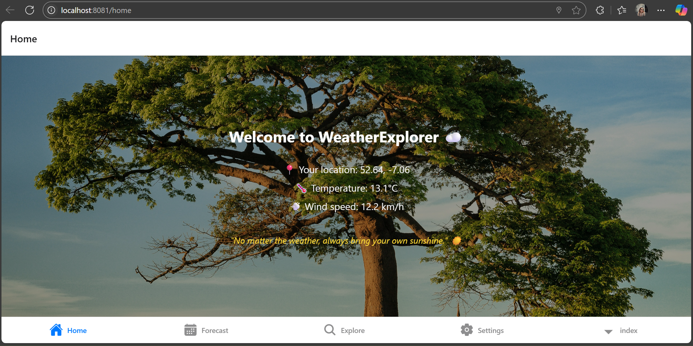
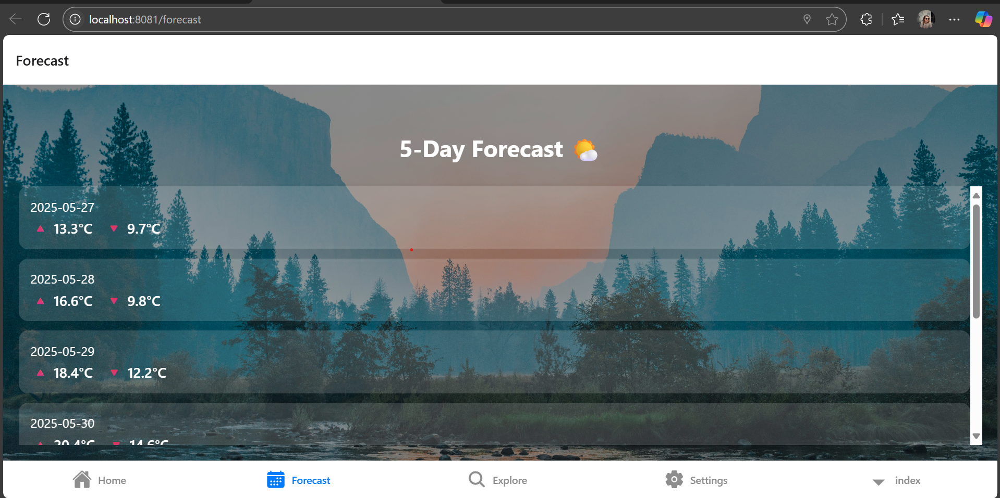
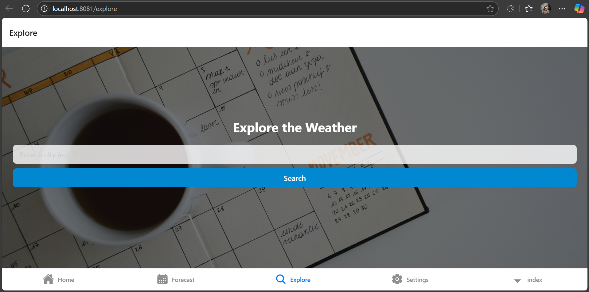
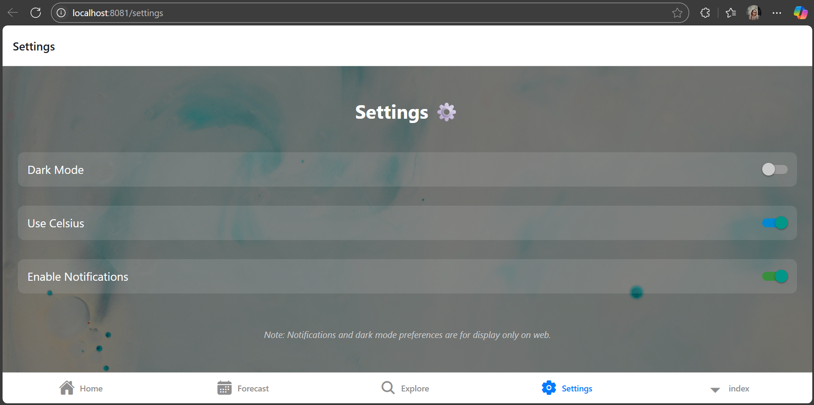

# Welcome to your Expo app 👋

# Gotcha Group 
 Team Members 

Jenny Priscila Matarrita Zuniga (2023104)   – Lead Programmer 

Kah Chung Wong (2023005)– UI/UX Design 

Abhinav Borgohain (2023287) – Testing 

Mary Karanja (2023331) – Documentation 

#  WeatherExplorer

**WeatherExplorer** is a cross-platform mobile application built with **React Native** and **Expo**.  
It allows users to search for weather forecasts by city or based on their current location, view a 5-day forecast, and enjoy a clean, nature-inspired UI with theme support and accessibility.

---

## Features

-  View weather based on your current location
-  Search weather by city name
-  See a 5-day forecast with min/max temperature
-  Temperature displayed in Celsius (switch included)
-  Light/Dark mode (toggle interface ready)
-  Notification toggle (UI present, logic optional)
-  Basic accessibility (`accessibilityLabel` on toggles)
-  Visually enhanced with professional background images

---

##  Screenshots

###  Home Screen


###  Forecast Screen


###  Explore Screen


###  Settings Screen



---

##  Technologies Used

- React Native
- Expo
- Open-Meteo API
- Expo Location
- React Navigation
- Expo Router

---

##  Installation

1. Clone the repository:

```bash
git clone https://github.com/jenpri/WeatherExplorer.git
cd WeatherExplorer

------------------------------------------------------------------------------------------------------------------------

This is an [Expo](https://expo.dev) project created with [`create-expo-app`](https://www.npmjs.com/package/create-expo-app).

## Get started

1. Install dependencies

   ```bash
   npm install
   ```

2. Start the app

   ```bash
   npx expo start
   ```

In the output, you'll find options to open the app in a

- [development build](https://docs.expo.dev/develop/development-builds/introduction/)
- [Android emulator](https://docs.expo.dev/workflow/android-studio-emulator/)
- [iOS simulator](https://docs.expo.dev/workflow/ios-simulator/)
- [Expo Go](https://expo.dev/go), a limited sandbox for trying out app development with Expo

You can start developing by editing the files inside the **app** directory. This project uses [file-based routing](https://docs.expo.dev/router/introduction).

## Get a fresh project

When you're ready, run:

```bash
npm run reset-project
```

This command will move the starter code to the **app-example** directory and create a blank **app** directory where you can start developing.

## Learn more

To learn more about developing your project with Expo, look at the following resources:

- [Expo documentation](https://docs.expo.dev/): Learn fundamentals, or go into advanced topics with our [guides](https://docs.expo.dev/guides).
- [Learn Expo tutorial](https://docs.expo.dev/tutorial/introduction/): Follow a step-by-step tutorial where you'll create a project that runs on Android, iOS, and the web.

## Join the community

Join our community of developers creating universal apps.

- [Expo on GitHub](https://github.com/expo/expo): View our open source platform and contribute.
- [Discord community](https://chat.expo.dev): Chat with Expo users and ask questions.
